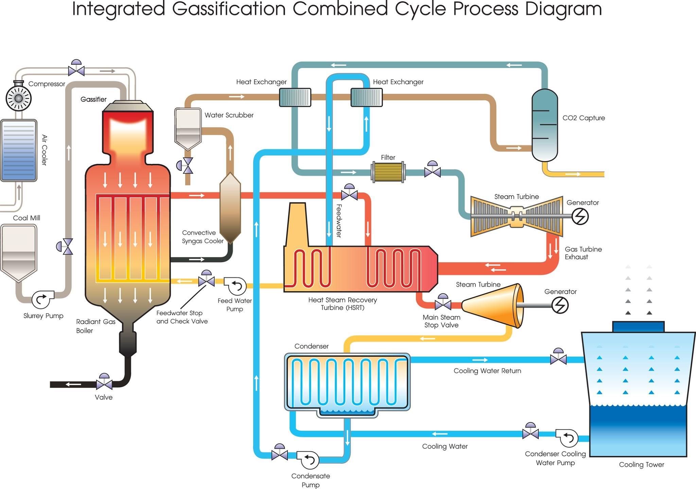

# Combined Cycle Efficiency Optimizer
### Project License
This project is licensed under the **Creative Commons Attribution-NonCommercial-ShareAlike 4.0 International (CC BY-NC-SA 4.0)** license.

> 🔗 **Live Dashboard:** [Access the Streamlit Application](https://combined-cycle-efficiency-optimizer-julen-neila-garcia.streamlit.app/)

## 🏗️ Project Overview
This project focuses on the performance optimization of a **Combined Cycle Power Plant (CCPP)**. By developing a digital twin using historical sensor data, the system predicts net hourly electrical power output (**PE**) and identifies the optimal operating setpoints to maximize efficiency under fluctuating ambient conditions.

### 🌡️ The Physics Behind Ambient Factors & Thermodynamic Impact
As a Mechanical Engineer, understanding the underlying thermodynamics is crucial to validate the machine learning model's behavior. Ambient parameters deeply affect the gas turbine cycle (Brayton) and the steam turbine cycle (Rankine):

* **Ambient Temperature (AT):** Higher ambient temperatures reduce air density. Since the gas turbine is a constant-volume machine, a lower air mass flow rate enters the compressor, decreasing the overall power output and efficiency.
* **Relative Humidity (RH) & Moisture Effects:** In thermal systems, high humidity levels alter the specific heat capacity of the working fluid. When air contains a high concentration of water vapor, additional energy is required just to heat up this non-reactive water mass up to the combustion temperature. In gas turbines or combustion furnaces, this creates an energy penalty (parasitic heat load), reducing the net power output.
* **Exhaust Vacuum (V):** A lower vacuum pressure in the condenser increases the overall enthalpy drop across the steam turbine, directly boosting the net generated Megawatts (MW).

---

## 🚀 Key Features
* **Prescriptive Optimization:** Implementation of a mathematical optimization module using `scipy.optimize` (**SLSQP**) to calculate the ideal exhaust vacuum (**V**) setpoint, maximizing power output based on real-time ambient inputs.
* **Mathematical Smoothing:** Utilizing a **Polynomial Regression (Degree 2 Pipeline)** to guarantee a continuous, differentiable surface. This mathematical pivot prevents gradient-based optimizers from getting trapped in local minima or discrete "steps" common in tree-based algorithms like XGBoost.
* **Feature Engineering:** Advanced thermodynamic indices integration (*Air Density Index, AT-V Interaction, Specific Humidity*) to enhance the model's physical intuition and convergence.
* **Interactive Dashboard:** A **Streamlit**-based UI that allows operators to perform real-time *"What-if"* analysis and optimization tasks.

---

## 🛠️ Tech Stack
* **Language:** Python
* **ML & Regressions:** Scikit-learn (PolynomialFeatures, LinearRegression, XGBRegressor,RandomForestRegressor, GradientBoostingRegressor)
* **Optimization Engine:** SciPy (SLSQP algorithm)
* **UI/Dashboard:** Streamlit
* **Data Engineering:** Pandas, NumPy
* **Visualization:** Matplotlib, Seaborn

---

## 📊 Model Performance & Insights
The Polynomial Pipeline achieves an outstanding balance between predictive accuracy and prescriptive utility:
* **$R^2$ Score:** 0.9419 (explaining over 94% of the operational variance).
* **RMSE:** 4.1060 MW (~1% relative error across the typical production range).

The digital twin correctly identifies the underlying thermodynamic principle: minimizing exhaust vacuum ($V$) maximizes the enthalpy drop across the steam turbine, leading to peak electrical power output (**PE**).

---

## 📁 Repository Structure
* `/data`: Contains the CCPP dataset.
* `/notebooks`: Exploratory Data Analysis (EDA), model benchmarking (XGBoost vs. Random Forest vs. Polynomial), and sensitivity analysis.
* `/img`: Images, graphics and correlation matrixes obtained from the EDA process.
* `/deployment`: The app script used for the streamlit demo and the pre-trained and serialized Polynomial Pipeline ready for production.
* `requirements.txt`: List of dependencies required to run the environment.

---

## 💻 Dashboard Deployment & Demo
The interactive console acts as a web-based **Digital Twin** for control-room decision-making. Operators can adjust weather conditions via sliders, and the optimization engine automatically calculates the target operation threshold.

---

## 🎯 Conclusions & Future Work
* **Prescriptive Success:** Transitioning from a tree-based model (XGBoost) to a smooth, continuous model (Polynomial) resolved numerical optimization deadlocks, unlocking stable gradient calculations.
* **Industrial Synergy:** Proves that combining data science frameworks with mechanical engineering domain knowledge produces robust, physically stable models.
* **Future Iterations:** Future updates will target adding a financial constraint module (calculating cooling tower pumping costs vs. MW gains) to find the absolute economic optimum, rather than just the thermodynamic maximum.

---

## 📄 License & Dataset Attribution

### Dataset Source
The data used in this project is sourced from the **Combined Cycle Power Plant dataset** hosted by the **UCI Machine Learning Repository**:
* **URL:** [UCI Machine Learning Repository - CCPP](https://archive.ics.uci.edu/dataset/294/combined+cycle+power+plant)
* **DOI:** [10.24432/C5002N](https://doi.org/10.24432/C5002N)

### Formal Citation
> P. Tufekci and H. Kaya. *"Combined Cycle Power Plant,"* UCI Machine Learning Repository, 2014. [Online]. Available: https://doi.org/10.24432/C5002N.

## 👤 About the Author
**Julen Neila Garcia** | [www.linkedin.com/in/julen-neila-garcia-a42304268]

*Passionate about bridging the gap between Mechanical Engineering and Industrial Data Science.*
